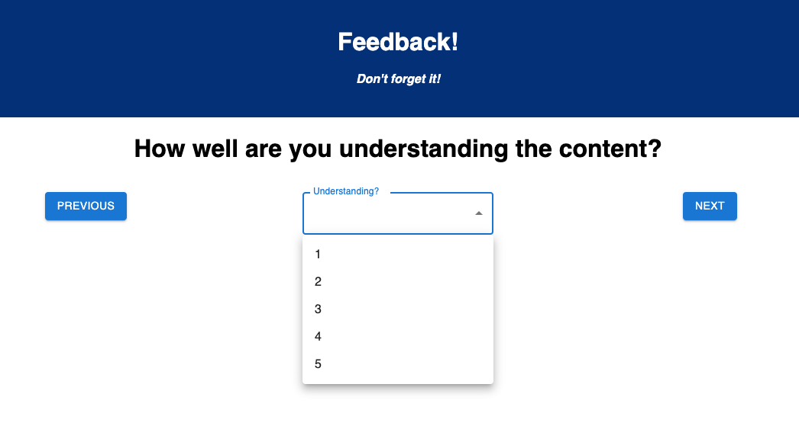
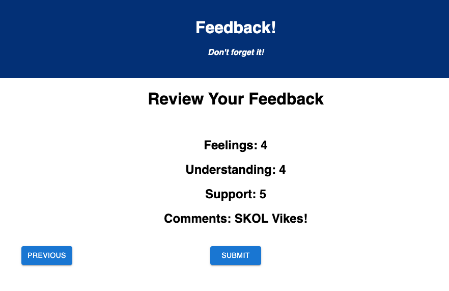

# Weekend Redux Feedback Loop

## Description

This is a multi-page form with inputs on every page to allow students to express how comfortable they are feeling, how well they understand material, how supported they feel and leave additional comments. They can go back to a previous page to edit their answers before submitting their form from a review page. Submitting from the review page will post the information to a database and all submitted forms can be viewed on an admin page where all submissions are listed within a table.

## Sample Images

## Installation
1. Fork and clone this repository.
2. Create a database named "prime_feedback".
3. Run the first SQL query in the database.sql file to set up a table. You can run the second query to populate sample data if you wish. This project was made with Postgres and Postico and will work nicely with that duo.
4. From your terminal run 'npm install'.
5. Then run 'npm run server' and 'npm run client' within separate terminal instances. This should automatically open a window in your browser to the first page of the form.
6. To access the admin page use the URL: http://localhost:3000/#/admin

## Built With
- React
- Redux
- Javascript
- HTML
- CSS
- Node.js
- Express
- PostgreSQL
- Material UI